# System Ofert Pracy

**Dokumentacja techniczno-użytkowa projektu**

**Autorzy:** Słysz Łukasz, Baran Sebastian, Brzozowski Konrad, Brahovska Daryna, Humennyi Yurii, Najdek Grzegorz  
**Uczelnia:** Państwowa Akademia Nauk Stosowanych w Jarosławiu  
**Rok akademicki:** 2025/2026  

---

## Wstęp i założenie projektu

Projekt „System Ofert Pracy” to nowoczesna aplikacja desktopowa stworzona w oparciu o technologię JavaFX procesem wytwórczym zwanym Agile z nastawieniem na rozmowę i osobiste zaangażowanie grupy. Jej głównym celem jest połączenie dwóch grup docelowych: kandydatów poszukujących zatrudnienia oraz pracodawców oferujących miejsca pracy. Aplikacja dostarcza obu grupom narzędzie do wygodnej publikacji i przeglądania ofert pracy oraz ułatwia proces rekrutacji, eliminując chaos związanych z tradycyjną wysyłką CV poprzez e-mail. System został podzielony na dedykowane panele dla różnych ról użytkowników: Kandydat -> Wyszukiwarka, Pracodawca -> Panel Pracodwacy oraz Administrator -> Panel Administratora. Całość opiera się na relacyjnej bazie danych MySQL, która zapewnia trwałość i integralność danych.

## Architektura i Baza Danych

Aplikacja wykorzystuje wzorzec architektoniczny MVC (Model-View-Controller) czyli jest podzielona na trzy niezależne warstwy w celu czytelności kodu oraz prostoty pracy w grupie. Widoki są zdefiniowane w plikach FXML, a logika znajduje się w odpowiadających im klasach kontrolerów. W projekcie zastosowany nowoczesny interfejs JavaFX wzbogacony o stylowanie CSS, a w tym między innymi możliwość przełączania się między jasnym i ciemnym motywem graficznym. Baza danych składa się z kilku kluczowych tabel, takich jak Users (centralna tabela autoryzacyjna), Candidates (przechowywująca dane kandydatów), Employers (przechowywująca dane pracodawców), JobOffers (przechowywująca dane ofert pracy) oraz Applications (łącząca kandydatów z ofertami pracy). Integralność danych zapewniana jest przez klucze obce oraz kaskadowe usuwanie rekordów.

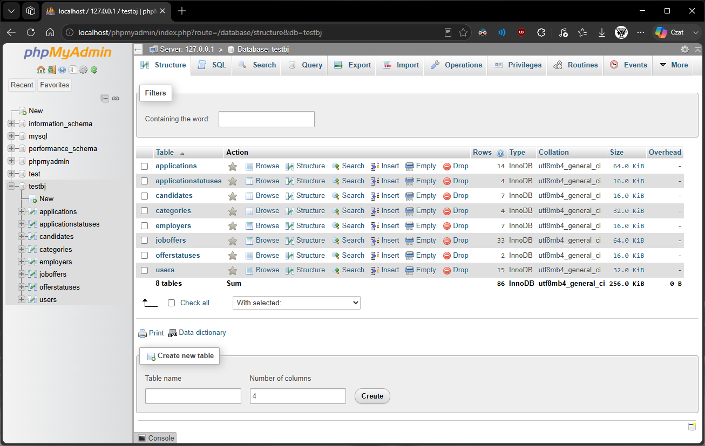

## 3. Moduł Autoryzacji i Bezpieczeństwa

Moduł logowania i rejestracji jest pierwszym punktem styku użytkownika z aplikacją. Obsługuje on zakładanie kont zarówno dla Kandydata jak i dla Pracodawcy, jednocześnie dbając o bezpieczeństwo poprzez walidację siły hasła i jego szyfrowania.

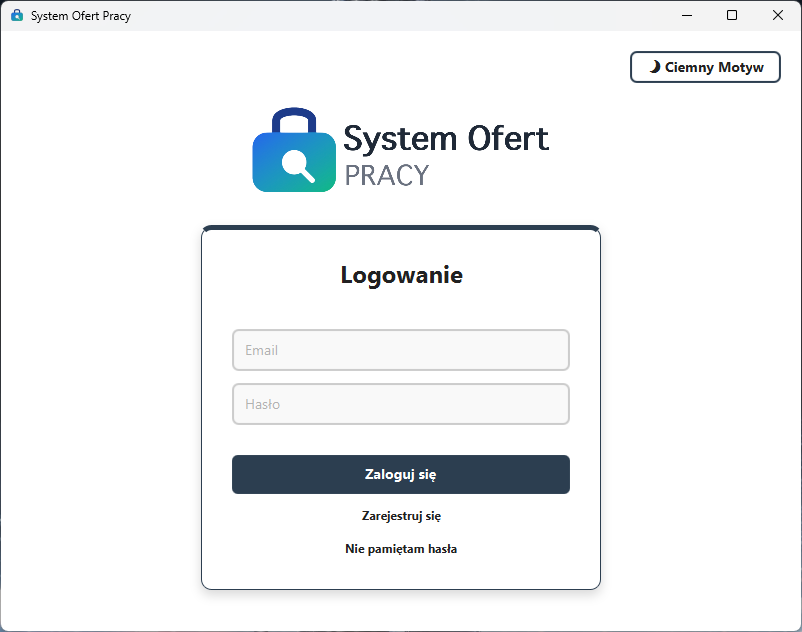

### 3.1. Mechanizm szyfrowania haseł

Hasła użytkowników nigdy nie są przechowywane w bazie danych w postaci jawnego tekstu. Zamiast tego, przed zapisem do bazy, hasło poddawane jest procesowi bezpiecznego haszowania za pomocą algorytmu SHA-256. Poniższy fragment kodu z klasy SecurityUtils prezentuje ten proces:

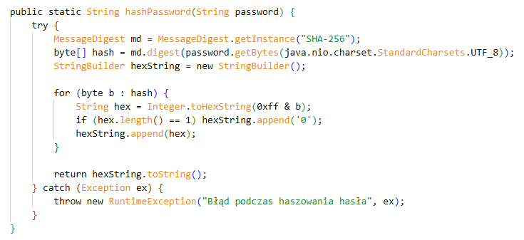

## 4. Panel Pracodawcy

Panel Pracodawcy to scentralizowane miejsce do zarządzania rekrutacją. Zalogowany przedstawiciel firmy może publikować nowe oferty pracy, edytować istniejące oferty, zamykać procesy rekrutacji oraz, co najważniejsze, weryfikować zgłoszenia kandydatów.

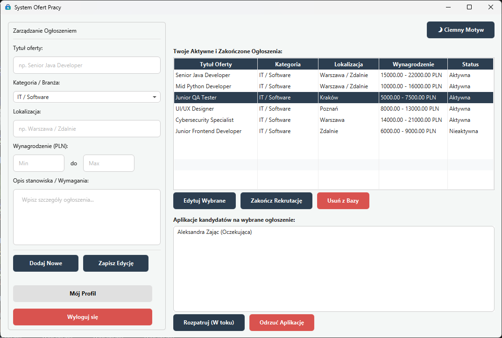

### 4.1. Publikacja nowej oferty pracy

Dodawanie ogłoszeń wymaga wypełnienia intuicyjnego formularza określającego tytuł oferty, kategorię/branżę, lokalizację, minimalne i maksymalne wynagrodzenie oraz szczegółowy opis ogłoszenia co ma skutkować możliwe maksymalnym zainteresowaniem ofertą pracy ze strony kandydatów.

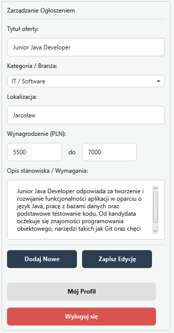

### 4.2. Weryfikacja Aplikacji

Po dwukrotnym naciśnięciu w zgłoszenie lewym przyciskiem myszy, pracodawca otrzymuje dostęp do szczegółowego profilu kandydata. Aplikacja ładuje dynamiczne okno dialogowe z danymi kontaktowymi, linkami (LinkedIn, GitHub) oraz specjalny przycisk pozwalający na bezpośrednie otwarcie załączonego pliku CV w formacie PDF.

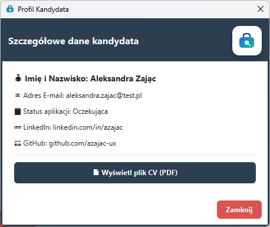

## 5. Panel kandydata (Wyszukiwarka)

Kandydaci po zalogowaniu zostają przekierowani do zaawansowanej wyszukiwarki ofert pracy. Mają możliwość dynamicznego filtrowania ogłoszenie według wielu kryteriów, aby szybko odnaleźć posadę odpowiadającą ich kompetencjom i wymaganiom.

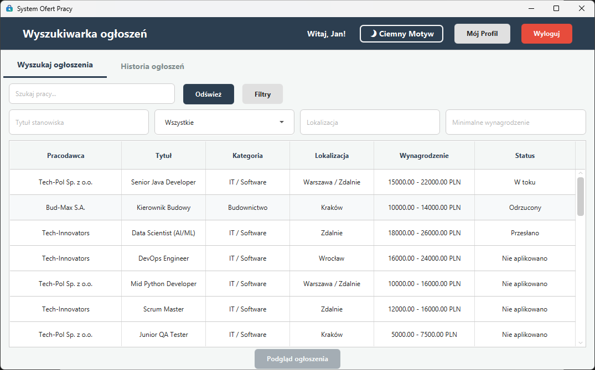

### 5.1. Dynamiczne filtrowanie danych

Za interaktywne filtrowanie danych w tabeli odpowiada klasa WyszukiwarkaController, która wykorzystuje strukturę FilteredList. Filtrowanie jest w pełni responsywne:

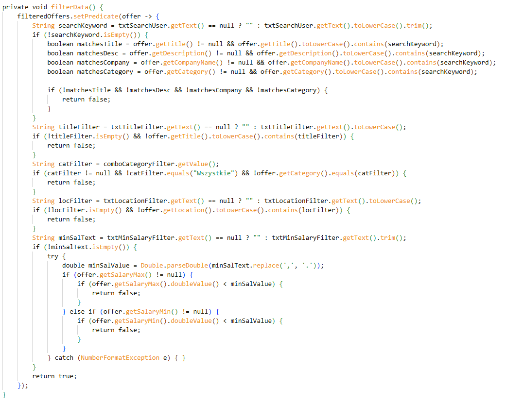

### 5.2. Informacja zwrotna aplikacji

Kandydat wykonujący czynności w panelu wyszukiwarki dostaje czytelną i klarowną informację zwrotną ze strony aplikacji co ułatwia korzystanie z niej i zapobiega dezorientacji użytkownika.

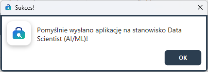

## 6. Panel Administratora

Administrator posiada pełen wgląd w działanie platformy i może zarządzać kontami użytkownika oraz zgłoszonymi ofertami pracy. Służy do tego dedykowana zakłada wyposażona we słane tabele analityczne.

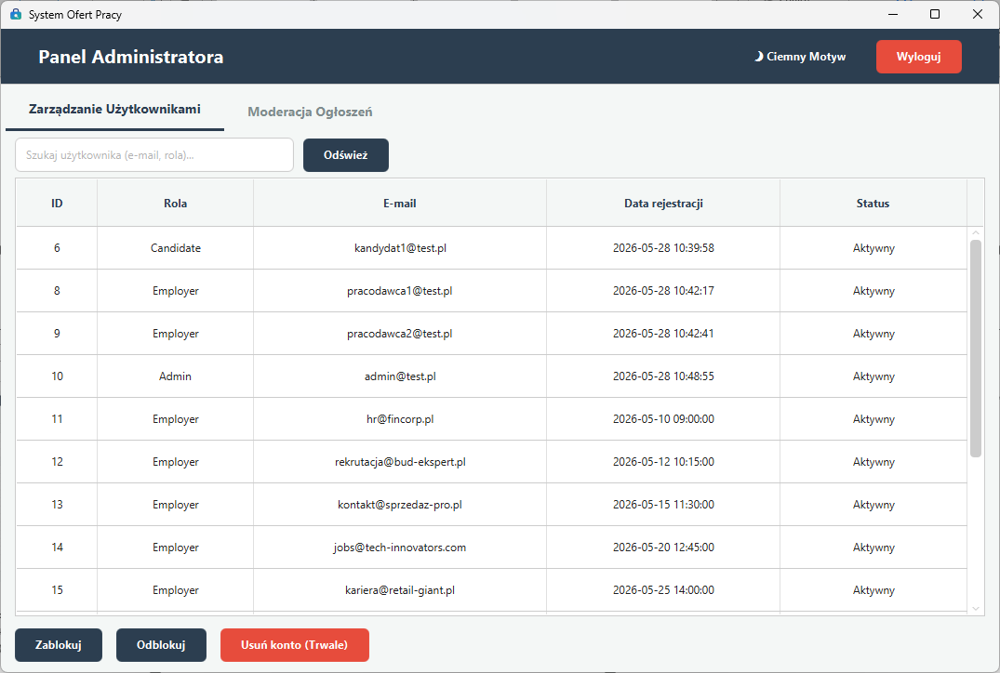

### 6.1. Zarządzanie użytkownikami

Kluczową funkcją administracyjną jest możliwość blokowania kont oraz ich usuwania (co uruchamia procedurę usuwania kaskadowego – wraz z kontem znikają wszystkie powiązane oferty i aplikacje). Funkcja blokowania w AdminPanelController wygląda następująco:

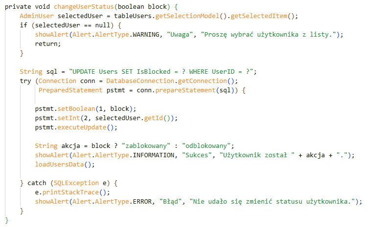

## 7. Zarządzanie Profilem

Niezależnie od posiadanej roli (Kandydat czy Pracodawca), użytkownicy mają dostęp do specjalnej przestrzeni konfiguracyjnej - swojego Profilu. Panel ten adaptuje się dynamicznie w zależności od tego, kto jest aktualnie zalogowany w sesji. Kandydaci wykorzystują tę przestrzeń do zmiany adresu pocztowego, hasła, dołączonego CV (po przez FileChooser) oraz udostępnionego profilu LinkedIn i GitHub.

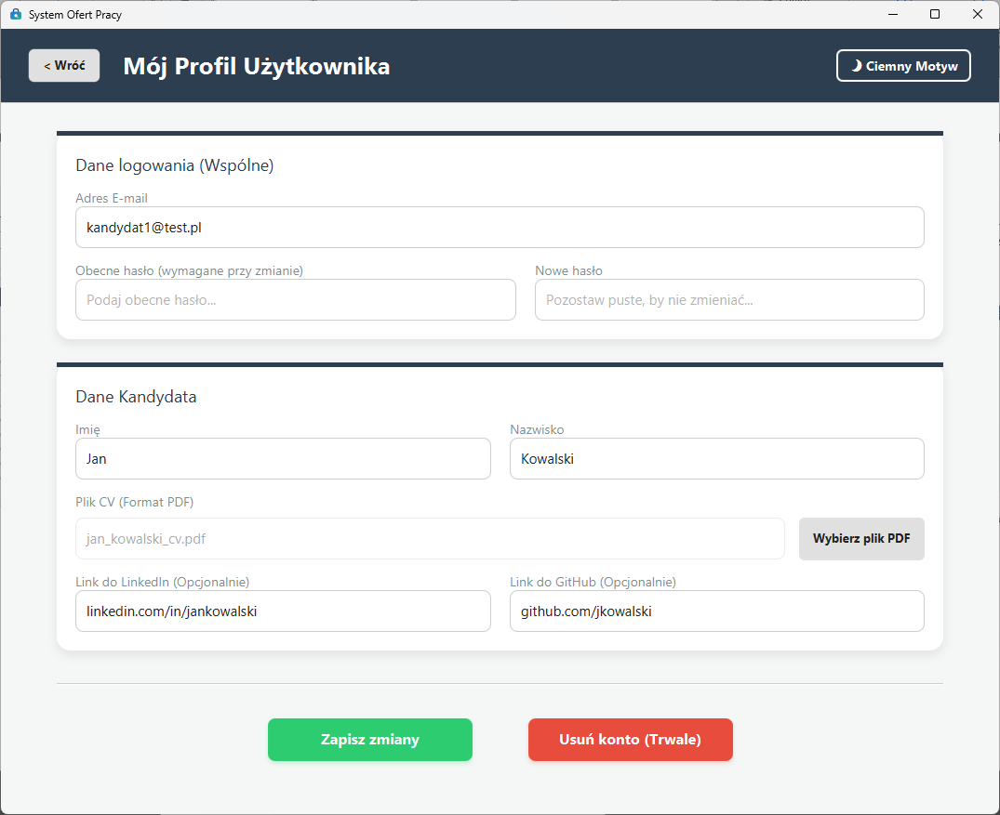

## 8. Podsumowanie

Stworzony System Ofert Pracy to rozbudowana aplikacja, która z powodzeniem integruje warstwę logiki, interfejs graficzny JavaFX oraz warstwę bazodanową. Zastosowanie obiektowego podejścia do programowanie, wzorca MVC i bezpiecznego zarządzania danymi sprawia, że jest to kompletne rozwiązanie spełniające wymagania nowoczesnych platform rekrutacji. Czynny udział w tym projekcie nauczył nas pracy w grupie, koordynacji zespołowej i uświadomił nam nasze mocne i słabe strony w programowaniu.